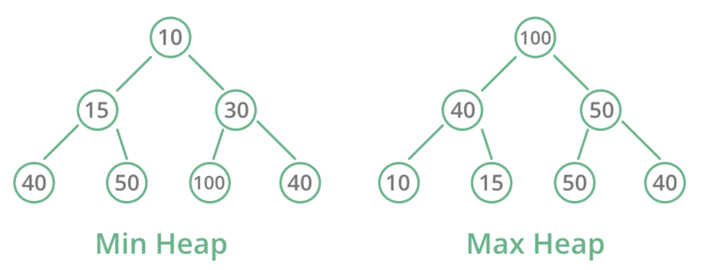
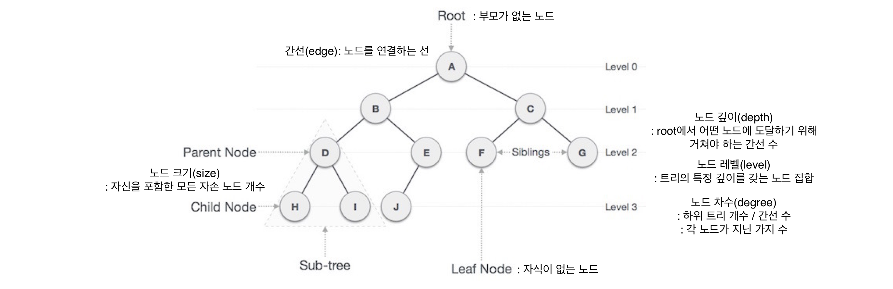
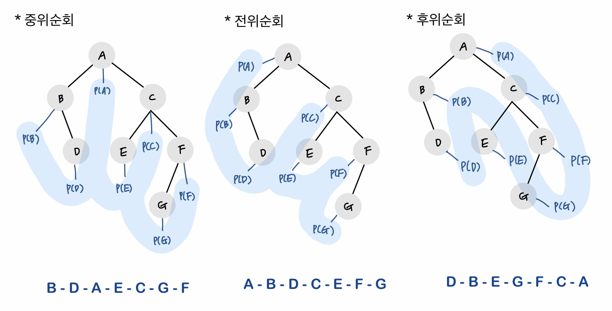
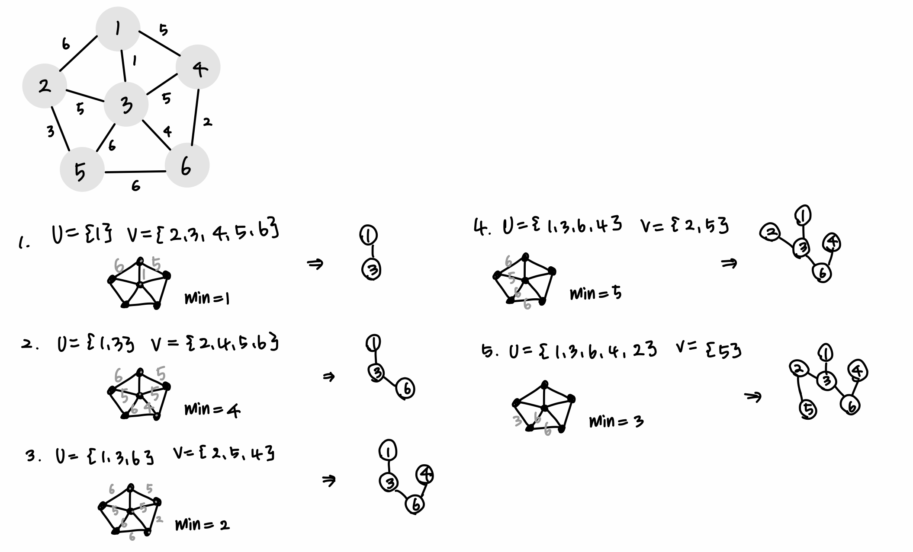
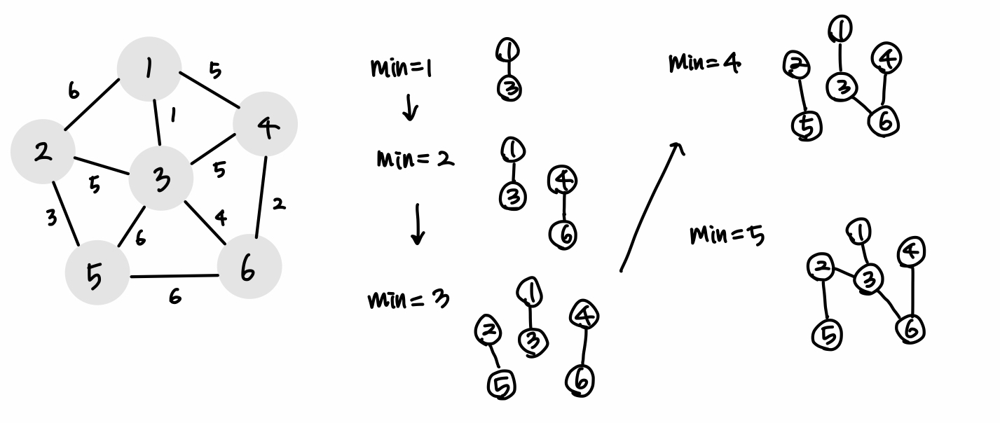

# 목차
- [Greedy algorithm](#_Greedy_algorithm)
- [Dijkstra algorithm](#_Dijkstra_Algorithm)
- [BellmanFord algorithm](#_BellmanFord_Algorithm)

주피터 무힌으로 커널 찾을 때 강제 종료 kill $(pgrep -f jupyter)

# Greedy algorithm

- 지금 가장 최적인 답을 근시안적으로 택하는 알고리즘, 현재 상황에서 지금 당장 좋은 것만 고른다.
- 관찰을 통해 탐색 범위를 줄이는 알고리즘
- 정당성 분석이 중요 : 단순히 지금 가장 좋은 방법을 반복해서 선택해도 최적의 해를 구할 수 있는지 검토하기.


## 노드 값의 합을 최대로 하기

→ 그리디 알고리즘으로 문제를 해결하려고 할 경우


: 일반적인 상황에서 그리디 알고리즘은 최적의 해를 보장할 수 없을 때가 많다.

: 하지만 코딩 테스트에서 대부분의 그리디 문제는 탐욕법으로 얻은 해가 최적의 해가 되는 상황에서, 이를 추론할 수 있어야 풀리도록 출제된다.


## 예시 - 거스름돈 문제
500원, 100원, 50원, 10원 동전으로 N원을 거슬러줘야 할 때, 주는 동전의 최소 개수를 구하기. N은 항상 10의 배수다.


### 문제 해결 아이디어

- 가장 큰 단위의 동전부터 거슬러주면 된다.
N원을 거슬러줘야 할 때, 500원으로 거슬러 줄 수 있을 때까지 거슬러주고, 100원-50원-10원 순으로 각각 거슬러 줄 수 있을 때까지 거슬러준다.


### 정당성 분석

: 가장 큰 화폐 단위부터 돈을 거슬러주는 게 최적의 해를 보장하는 이유

- 동전들은 큰 단위가 항상 작은 단위의 배수이므로
- 작은 단위의 동전들을 종합해 다른 해가 나오는 경우가 없기 때문이다.
- 예를 들어, 화폐 단위가 500원, 400원, 100원이고 800원을 거슬러주는 상황이라면 그리디 알고리즘으로 문제를 해결할 수 없다.
```python
N = 1260
count = 0
array = [500, 100, 50, 10]

for coin in array:
	count += N # coin
	N %= coin
```


### 시간 복잡도 O(K)

- K는 동전의 종류 개수
- for 문이 동전의 종류 수만큼 돈다.
- 거슬러줘야 하는 금액과 무관하게 동전의 총 종류에만 영향을 받는다.

* * *
* * *

# 그래프 탐색하기

: 하나의 정점으로부터 시작하여 차례대로 모든 정점들을 한 번씩 방문하기

## DFS(Depth First Search) - 깊이 우선 탐색
## BFS(Breadth-First Search) - 넓이 우선 탐색

    

1. **DFS**

    : 최대한 깊이 내려간 뒤, 더이상 깊이 갈 곳이 없을 경우 옆으로 이동

    - 한 노드에서 시작해서 다음 분기(branch)로 넘어가기 전에 **해당 분기를 완벽하게 탐색**하는 방식
    - ex) 미로찾기 - 최대한 한 방향으로 갈 수 있을 때까지 쭉 가다가 더 이상 갈 수 없게 되면 다시 가장 가까운 갈림길로 돌아와서 그 갈림길부터 다시 다른 방향으로 탐색을 진행한다.

    1. 모든 노드를 방문하고자 하는 경우에 이 방법을 선택함

    2. 깊이 우선 탐색(DFS)이 너비 우선 탐색(BFS)보다 **좀 더 간단함**

    3. 검색 속도 자체는 너비 우선 탐색(BFS)에 비해서 **느림**

    - 스택 + 재귀함수로 구현

2. **BFS**

    :  최대한 넓게 이동한 다음, 더 이상 갈 수 없을 때 아래로 이동

    - 루트 노드(혹은 다른 임의의 노드)에서 시작해서 **인접한 노드를 먼저** **탐색**하는 방법
    - 시작 정점으로부터 가까운 정점을 먼저 방문하고 멀리 떨어져 있는 정점을 나중에 방문하는 순회 방법
    - 주로 두 노드 사이의 **최단 경로**를 찾고 싶을 때 이 방법을 선택한다.
    - 큐를 이용해서 구현

- ex) 지구 상에 존재하는 모든 친구 관계를 그래프로 표현한 후 Sam과 Eddie사이에 존재하는 경로를 찾는 경우
    - 깊이 우선 탐색의 경우 - 모든 친구 관계를 다 살펴봐야 할지도 모름
    - 너비 우선 탐색의 경우 - Sam과 가까운 관계부터 탐색

**💡 DFS와 BFS의 시간복잡도**

두 방식 모두 조건 내의 모든 노드를 검색한다는 점에서 시간 복잡도는 동일하다.

DFS와 BFS 둘 다 다음 노드가 방문하였는지를 확인하는 시간과 각 노드를 방문하는 시간을 합하면 된다.

N은 노드, E는 간선일 때

> 인접 리스트 : O(N+E)

> 인접 행렬 : O(N²)

일반적으로 E(간선)의 크기가 N²에 비해 상대적으로 적기 때문에

인접 리스트 방식이 효율적임

**3. 깊이 우선 탐색(DFS)과 너비 우선 탐색(BFS) 활용한 문제 유형/응용**

특징에 따라 사용에 더 적합한 문제 유형들 있음!

1) 그래프의 **모든 정점을 방문**하는 것이 주요한 문제

단순히 모든 정점을 방문하는 것이 중요한 문제의 경우 DFS, BFS 둘 중 아무거나 사용해도 상관 없음

2) **경로의 특징**을 저장해둬야 하는 문제 ; DFS

예를 들면 각 정점에 숫자가 적혀있고 a부터 b까지 가는 경로를 구하는데 경로에 같은 숫자가 있으면 안 된다는 문제 등, 각각의 경로마다 특징을 저장해둬야 할 때는 DFS를 사용한다. (BFS는 경로의 특징을 가지지 못함)

3) **최단거리** 구해야 하는 문제 ; BFS

미로 찾기 등 최단거리를 구해야 할 경우, BFS가 유리하다.

왜냐하면 깊이 우선 탐색으로 경로를 검색할 경우 처음으로 발견되는 해답이 최단거리가 아닐 수 있지만, 너비 우선 탐색으로 현재 노드에서 가까운 곳부터 찾기 때문에 경로를 탐색 시 먼저 찾아지는 해답이 곧 최단거리기 때문

4) 검색 대상 그래프가 정말 크다면 DFS를 고려

5) 검색대상의 규모가 크지 않고, 검색 시작 지점으로부터 원하는 대상이 별로 멀지 않다면 BFS


* * *
* * *


# Dijkstra Algorithm
다이나믹 프로그래밍을 활용한 대표적인 최단 경로 탐색 알고리즘이다. 
- 최단 거리는 여러 개의 최단 거리로 이루어져 있기 때문에, 작은 문제가 큰 문제의 부분 집합에 속해있다고 볼 수 있다.
- 다익스트라는 하나의 최단 거리를 구할 때 이전까지 구해왔던 최단 거리 정보를 그대로 사용한다는 특징이 있다.

특정 정점에서 다른 모든 정점으로 가는 최단 경로를 알려준다. 다만 이 때 음의 간선을 포함할 수 없다. (이 특징 때문에 현실 세계에서 사용하기 매우 적합한 알고리즘 중 하나다.)


## - 작동 과정
1. 출발 노드 설정
2. 노드를 기준으로 각 노드의 최소 비용 저장
3. 방문하지 않은 노드 중 가장 비용이 적은 노드 선택
4. 해당 노드를 거쳐 다른 특정 노드로 가는 경우도 고려하여 최소 비용 갱신
5. 3 - 4 반복


## Heap 자료구조
힙(Heap)은 특정한 규칙을 갖는 트리로, 최댓값과 최솟값을 찾는 연산을 빠르게 하기 위해 고안된 완전이진트리를 기반으로 한다.

A가 B의 부모노드일 때, A의 키 값과 B의 키 값 사이에는 대소 관계가 성립한다.
- 최소 힙 : 부모 노드 키 값 < 자식 노드 키 값
- 최대 힙 : 부모 노드 키 값 > 자식 노드 키 값




### 파이썬 heapq 모듈
: 리스트를 최소 힙처럼 다룰 수 있도록 하는 파이썬 내장 모듈

: 모든 부모 노드는 해당 자식 노드보다 값이 작은 이진트리 구조다.

- 사용 방법
```python
import heapq 
#  빈 리스트 생성 후 원소 추가
heap = []
headq.heappush(heap, 10)


# 리스트를 힙 자료형으로 변환
heap = [10, 20, 30]
heapq.heapify(heap)

# 힙에서 원소 삭제
# heappop : 가장 작은 원소를 힙에서 제거함과 동시에 해당 원소 리턴
result = heapq.heappop(heap)

# 원소를 삭제하지 않고 가져오고 싶을 경우
# [0]
result = heap[0]
```

* * *
* * *


# BellmanFord Algorithm
다익스트라 알고리즘보다 일반적으로 느리지만, 변의 가중치가 음수일 때 사용할 수 있기 때문에 좀 더 유연하게 사용할 수 있다.

하지만 만약 음수 사이클이 그래프에 있으면 이 알고리즘을 써서 정확한 최단 경로가 나오는 것을 보장할 수는 없다. 이게 무슨 소리냐 하면, 가장 싼 톨비로 목적지 까지 가는 알고리즘을 만들기 위해 고속 도로를 그래프로 만든다고 생각해보자. 이 그래프의 가중치는 톨비일 것이고 알고리즘의 목표는 출발지에서 부터 최소 톨비로 갈 수 있는 경로를 찾는 것이다. 일반적인 상황에서라면 이런 그래프에서 벨먼-포드 알고리즘은 문제 없이 작동 할것이다.
그런데 만약 어떤 톨게이트에서 고객 감사 행사로 톨비 100원을 받는 대신에 100원을 준다고 하면? 그리고 이 톨게이트에서 나오자마자 다시 돌아가서 계속 반복으로 이 돈을 받을수 있다면? 그렇다면 이 톨게이트를 뺑글 뺑글 도는것 만으로도 무한으로 돈을 받을 수 있을 것이고 톨비는 계속 줄어들 것이다. 이게 바로 음수의 사이클이다. 이런 사이클이 있으면 벨먼-포드 알고리즘은 무한의 루프에 빠지게 되고, 최저 비용 거리를 구할 수 없게 된다. 물론 벨먼-포드 알고리즘을 실행했을 때 음수의 사이클이 있는지 없는지도 확인할 수 있으므로 알고리즘 자체의 본질적인 문제는 아니다. 아래 의사코드에서 마지막 for문에서 확인하는 것이 음수 사이클이 있는지 확인하는 것이다. 만약 음수 사이클이 있다면, 사이클을 한번 돌 때마다 간선이 완화가 된다. 그래서 맨 마지막 for문에서 간선을 V-1번씩 확인했음에도 불구하고 완화할 수 있는 엣지가 있다면 음수 사이클이 있다고 판단할 수 있다.


```python
BellmanFord(G,w,s):
    #초기화 과정
    for each u in G.V:     #노드를 초기화 하기
        distance[v] = inf      #모든 노드의 최단거리를 무한으로 지정
        parent[v] = null       #모든 노드의 부모 노드를 널값으로 지정

    distance[s] = 0 #출발점의 최단거리는 0으로 지정한다

    #거리측정 과정
    for i from 1 to len(G.V):   #노드 개수만큼 n-1 번 반복
        for each (u,v) in G.E:   #모든 간선을 체크해 최단 거리를 찾아본다.
            if distance[u] + w[(u,v)] < distance[v]:   
            #만약 u를 경유하여 v로 가는 거리가 현재 v의 최단 거리보다 짧으면
                distance[v] = distance[u] + w[(u,v)]  #그 거리를 v의 최단거리로 지정
                parent[v] = u   #u를 v의 부모 노드로 지정

    #음수 사이클 체크 과정
    #: 모든 간산 e개 하나씩 확인해서 거쳐서 가는게 더 짧을 경우 (최단 거리 테이블 업데이트될 경우) 음수 간선 순환 존재하는것
    for each (u,v) in G.E:
        if distance[u] + w[(u,v)] < distance[v]:
            return false #음수 사이클을 확인하고 알고리즘을 정지

    return distance[], parent[]
```

***
***

# 트리
: 노드로 이루어진 자료구조
- 구성
    - root node 1개
    - 0개 이상의 자식 노드
    - 그 자식 노드도 0개 이상의 자식 노드 -> 반복적으로 정의됨
 

- node + edge
    - 사이클이 존재할 수 없음
    - 노드들은 특정 순서로 나열될 수도 있고, 아닐 수도 있다.
    - 각 노드는 부모 노드로의 연결이 있을 수도, 없을 수도 있다.
    - 각 노드는 어떤 자료형으로도 표현 가능하다.
    - 노드가 n개인 트리는 n-1개의 간선을 갖는다.

- 비선형 자료구조로 계층적 관계를 표현한다. 
    - : 계층 모델이다.


- 그래프의 한 종류
    - 사이클이 없는 하나의 연결 그래프다.
    - DAG(Directed Acyclic Graph, 방향성이 있는 비순환 그래프)의 한 종류다.
        - loop, circuit, self-loop, cycle 없음

- 종류 : 이진트리, 이진탐색트리, 균형트리, 이진 힙 등



## 이진트리
: 각 노드가 최대 두 개의 자식을 갖는 트리
- 이진트리 ⊂ 트리
- depth 구하는 연산 : 해당 노드가 몇 번째 level(depth) 갖는지 알 수 있다.
```python
class Node:

    def __init__(self, item):
        self.data = item
        self.left = None
        self.right = None

    def size(self):
        l = self.left.size() if self.left else 0
        r = self.right.size() if self.right else 0
        return l + r + 1

    def depth(self):
        leftDepth = self.left.depth() if self.left else 0
        rightDepth = self.right.depth() if self.right else 0
        return leftDepth + 1 if leftDepth > rightDepth else rightDepth + 1

class BinaryTree:
    def __init__(self, r):
        self.root = r

    def size(self):
        if self.root: return self.root.size()
        else: return 0

    # or

    def depth(self):
        if self.root: return self.root.depth()
        else: return 0
```
또는 클래스 안에 nodeCount 라는 멤버 변수를 만들어서 insert() 연산 할 때마다 증가시켜도 된다.

- 이진트리순회
    - 중위 순회
    - 전위 순회
    - 후위 순회


```python
class Node:
    def __init__(self, item):
        self.data = item
        self.left = None
        self.right = None

    def inorder(self):
        traversal = []
        if self.left: traversal += self.left.inorder()
        traversal.append(self.data)
        if self.right: traversal += self.right.inorder()
        return traversal

    def preorder(self):
        traverse = []
        traverse.append(self.data)
        if self.left: traverse += self.left.preorder()
        if self.right: traverse += self.right.preorder()
        return traverse

    def postorder(self):
        traverse = []
        if self.left: traverse += self.left.postorder()
        if self.right: traverse += self.right.postorder()
        traverse.append(self.data)
        return traverse


class BinaryTree:
    def __init__(self, r):
        self.root = r

    def inorder(self):
        if self.root: return self.root.inorder()
        else: return []

    def preorder(self):
        if self.root: return self.root.preorder()
        else: return []

    def postorder(self):
        if self.root: return self.root.postorder()
        else: return []
```

## 신장트리(생성트리)
: 그래프 내의 모든 노드들을 포함하는 트리
- Spanning Tree = 신장 트리 = 스패닝 트리
- Spanning Tree는 그래프의 최소 연결 부분 그래프 이다.
    - 최소 연결 = 간선의 수가 가장 적다.
    - n개의 정점을 가지는 그래프의 최소 간선의 수는 (n-1)개이고, (n-1)개의 간선으로 연결되어 있으면 필연적으로 트리 형태가 되고 이것이 바로 Spanning Tree가 된다.
즉, 그래프에서 일부 간선을 선택해서 만든 트리

## 최소신장트리
: Spanning Tree 중에서 사용된 간선들의 가중치 합이 최소인 트리

- MST = Minimum Spanning Tree = 최소 신장 트리
- 각 간선의 가중치가 동일하지 않을 때 단순히 가장 적은 간선을 사용한다고 해서 최소 비용이 얻어지는 것은 아니다.
- MST는 간선에 가중치를 고려하여 최소 비용의 Spanning Tree를 선택하는 것을 말한다.
- 즉, 네트워크(가중치를 간선에 할당한 그래프)에 있는 모든 정점들을 가장 적은 수의 간선과 비용으로 연결하는 것이다.

### MST의 특징
- 간선의 가중치의 합이 최소여야 한다.
- n개의 정점을 가지는 그래프에 대해 반드시 (n-1)개의 간선만을 사용해야 한다.
사이클이 포함되어서는 안된다.

### MST의 구현 방법
### 프림 알고리즘
시작 정점에서부터 출발하여 신장트리 집합을 단계적으로 확장 해나가는 방법
- 정점 선택을 기반으로 하는 알고리즘이다.
- 이전 단계에서 만들어진 신장 트리를 확장하는 방법이다.
[과정]
1. 시작 단계에서는 시작 정점만이 MST(최소 비용 신장 트리) 집합에 포함된다.
2. 앞 단계에서 만들어진 MST 집합에 인접한 정점들 중에서 최소 간선으로 연결된 정점을 선택하여 트리를 확장한다.
- 즉, 가장 낮은 가중치를 먼저 선택한다.
3. 위의 과정을 트리가 (N-1)개의 간선을 가질 때까지 반복한다.




### 크루스칼 알고리즘
탐욕적인 방법(greedy method) 을 이용하여 네트워크(가중치를 간선에 할당한 그래프)의 모든 정점을 최소 비용으로 연결하는 최적 해답을 구하는 것

- MST(최소 비용 신장 트리) 가 1) 최소 비용의 간선으로 구성됨 2) 사이클을 포함하지 않음 의 조건에 근거하여 각 단계에서 사이클을 이루지 않는 최소 비용 간선을 선택 한다.
- 간선 선택을 기반으로 하는 알고리즘이다.
- 이전 단계에서 만들어진 신장 트리와는 상관없이 무조건 최소 간선만을 선택하는 방법이다.
[과정]
1. 그래프의 간선들을 가중치의 오름차순으로 정렬한다.
2. 정렬된 간선 리스트에서 순서대로 사이클을 형성하지 않는 간선을 선택한다.
- 즉, 가장 낮은 가중치를 먼저 선택한다.
- 사이클을 형성하는 간선을 제외한다.
3. 해당 간선을 현재의 MST(최소 비용 신장 트리)의 집합에 추가한다.





